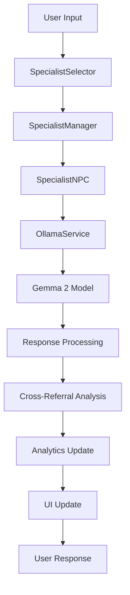

#  Local LLM NPC: Agricultural University Platform
**World's First Multi-Agent AI Educational Platform for Agriculture**  
*Developed by Om Choksi | 2025*

---

[](https://godotengine.org/)
[](https://dotnet.microsoft.com/)
[](https://ollama.ai/)
[](LICENSE)

---

##  Table of Contents

1. [ Project Overview](#-project-overview)
2. [ Key Features](#-key-features)
3. [ AI Professors](#-ai-professors)
4. [ Quick Start](#-quick-start)
5. [ System Requirements](#-system-requirements)
6. [ Installation](#-installation)
7. [ Configuration](#️-configuration)
8. [ Running the Platform](#-running-the-platform)
9. [ Demo Video Guide](#-demo-video-guide)
10. [ Troubleshooting](#️-troubleshooting)
11. [ Technical Architecture](#️-technical-architecture)
12. [ Development Setup](#-development-setup)
13. [ License & Credits](#-license--credits)

---

##  Project Overview

**Local LLM NPC Agricultural University** is a groundbreaking educational platform that revolutionizes agricultural learning through artificial intelligence. This innovative system creates the world's first virtual agricultural university, featuring 7 specialized AI professors powered by advanced Gemma language models running completely offline.

###  Mission Statement
*"Democratizing agricultural education through AI-powered, multi-agent learning systems that provide personalized, expert-level instruction accessible to everyone, anywhere, anytime."*

###  Innovation Highlights
- **World's First** multi-agent agricultural education platform
- **100% Offline Operation** - no internet required after setup
- **Advanced AI Integration** - Gemma 2 models with specialized agricultural knowledge
- **Multi-Specialist Collaboration** - AI professors that work together and cross-reference
- **Adaptive Learning** - personalized difficulty and pacing
- **Professional Assessment** - comprehensive evaluation and progress tracking

---

##  Key Features

###  **Multi-Agent AI System**
- **7 Specialized AI Professors** with domain expertise spanning all agricultural sciences
- **Cross-Referral Intelligence** - professors recommend each other based on topic relevance
- **Collaborative Problem Solving** - multiple specialists working together on complex issues
- **15-30 Years Simulated Experience** - each professor has deep, specialized knowledge

###  **Advanced Learning Analytics**
- **Real-time Progress Tracking** across all agricultural domains
- **Competency Mapping** - visual representation of skill development
- **Learning Pattern Recognition** - AI adapts to your learning style
- **Performance Analytics** - detailed insights into your educational journey

###  **Adaptive Assessment System**
- **Dynamic Difficulty Adjustment** - questions adapt to your skill level
- **Multiple Assessment Types** - theoretical, practical, and scenario-based evaluations
- **Instant Feedback** - immediate scoring and improvement recommendations
- **Certification Ready** - track progress toward agricultural certifications

###  **Privacy-First Design**
- **Complete Offline Operation** - no data transmission to external servers
- **Local AI Processing** - all conversations processed on your device
- **Secure Learning Environment** - your educational data stays private
- **GDPR Compliant** - privacy by design architecture

###  **Natural Language Processing**
- **Human-like Conversations** - natural dialogue with AI professors
- **Context Awareness** - professors remember previous conversations
- **Multi-language Support** - expandable to multiple languages
- **Voice Integration Ready** - prepared for future voice interaction features

---

##  AI Professors

###  **Dr. Terra Firma** - *Soil Science Professor*
**Expertise**: Soil Chemistry, Soil Biology, Nutrition Management  
**Experience**: 20 years in soil science research and education  
**Specializes in**: pH management, nutrient deficiency diagnosis, soil testing, composting integration

###  **Dr. Flora Verde** - *Plant Biology Professor*  
**Expertise**: Plant Physiology, Genetics, Crop Science  
**Experience**: 25 years in plant biology and crop development  
**Specializes in**: Plant disease diagnosis, growth optimization, breeding programs, photosynthesis

###  **Hydro Henderson** - *Water Management Consultant*
**Expertise**: Irrigation Systems, Water Conservation, Hydroponic Systems  
**Experience**: 18 years in agricultural water management  
**Specializes in**: Drip irrigation, water scheduling, drought management, aquaponics

###  **Compost Carl** - *Composting Master*
**Expertise**: Organic Waste Management, Soil Amendment, Sustainability  
**Experience**: 15 years in composting and organic farming  
**Specializes in**: Compost recipes, decomposition science, organic certification, waste reduction

### **Dr. Beneficial Betty** - *IPM Research Specialist*
**Expertise**: Integrated Pest Management, Beneficial Insects, Organic Solutions  
**Experience**: 22 years in entomology and pest management  
**Specializes in**: Biological controls, pest identification, beneficial ecosystems, organic pesticides

###  **Perma Pete** - *Permaculture Design Master*
**Expertise**: Sustainable Design, Ecosystem Management, Regenerative Agriculture  
**Experience**: 30 years in permaculture and sustainable systems  
**Specializes in**: Design principles, food forests, water harvesting, biodiversity enhancement

###  **Professor Green Thumb** - *General Agriculture Coordinator*
**Expertise**: Farm Management, Agricultural Technology, Extension Services  
**Experience**: 28 years in agricultural education and extension  
**Specializes in**: Farm planning, technology integration, crop rotation, business planning

---

##  Quick Start

> ** Get up and running in under 5 minutes!**

###  **Option 1: Ready-to-Run Executables** *(Recommended)*

#### For Windows Users:
```powershell
# 1. Navigate to Windows binaries
cd BIN/WINDOWS/

# 2. Run the executable
./local-llm-npc\ \(4.4\).exe
```

#### For Linux Users:
```bash
# 1. Navigate to Linux binaries  
cd BIN/LINUX/

# 2. Make executable and run
chmod +x local-llm-npc\ \(4.4\).x86_64
./local-llm-npc\ \(4.4\).x86_64
```

###  **Option 2: Development Mode** *(For Developers)*

```bash
# 1. Clone the repository
git clone https://github.com/your-username/local-llm-npc.git
cd local-llm-npc

# 2. Install dependencies
dotnet restore

# 3. Open in Godot 4.4.1
godot4 project.godot

# 4. Press F5 to run
```

###  **AI Setup** *(Required for Both Options)*

```bash
# Install Ollama (AI Engine)
curl -fsSL https://ollama.ai/install.sh | sh  # Linux/macOS
# Windows: Download from https://ollama.ai/download/windows

# Start Ollama service
ollama serve

# Install AI models (choose one)
ollama pull gemma2:2b    # Fast, lightweight (4GB RAM)
ollama pull gemma2:9b    # Better quality (16GB RAM)
ollama pull gemma2:27b   # Best quality (32GB RAM)
```

###  **First Launch Configuration**

1. **Launch the platform** using one of the methods above
2. **Configure Ollama URL**: Set to `http://localhost:11434`
3. **Select your learning level**: Beginner, Intermediate, or Advanced
4. **Choose your first professor** and start learning!

---

##  System Requirements

###  **Minimum Requirements**
| Component | Specification |
|-----------|---------------|
| **Operating System** | Windows 10/11, Ubuntu 20.04+, macOS 12+ |
| **Memory (RAM)** | 8GB (12GB recommended for AI) |
| **Storage** | 5GB free space |
| **Processor** | Intel i5 / AMD Ryzen 5 (quad-core) |
| **Graphics** | Integrated graphics sufficient |
| **Network** | Required only for initial setup |

###  **Recommended Specifications**
| Component | Specification |
|-----------|---------------|
| **Memory (RAM)** | 16GB+ for optimal AI performance |
| **Storage** | SSD with 10GB+ free space |
| **Processor** | Intel i7/i9 / AMD Ryzen 7/9 |
| **Graphics** | NVIDIA RTX / AMD RDNA2+ (optional) |
| **AI Models** | Support for 2B-27B parameter models |

###  **Supported AI Models**
- **Gemma 2 Series**: 2B, 9B, 27B variants (recommended)
- **Llama 3.1**: 8B, 70B variants (alternative)
- **Phi-3**: Mini, Small, Medium (lightweight alternative)
- **CodeLlama**: 7B, 13B (development support)

---

##  Installation

###  **Pre-Installation Checklist**

- [ ] Verify system meets minimum requirements
- [ ] Ensure stable internet connection for initial setup
- [ ] Have administrative privileges for software installation
- [ ] Close unnecessary applications to free up memory

###  **Step 1: Install Ollama AI Engine**

Choose your operating system:

#### **Windows Installation**
```powershell
# Option 1: Download installer
# Visit: https://ollama.ai/download/windows

# Option 2: Use Windows Package Manager
winget install Ollama.Ollama

# Verify installation
ollama --version
```

#### **macOS Installation**
```bash
# Option 1: Homebrew (recommended)
brew install ollama

# Option 2: Direct download
# Visit: https://ollama.ai/download/macos

# Verify installation
ollama --version
```

#### **Linux Installation**
```bash
# Ubuntu/Debian/Most Linux distributions
curl -fsSL https://ollama.ai/install.sh | sh

# Verify installation
ollama --version
```

### **Step 2: Install AI Models**

```bash
# Start Ollama service (run in background)
ollama serve &

# Choose and install your preferred model:

#  Fast & Lightweight (4-8GB RAM)
ollama pull gemma2:2b

#  Balanced Performance (12-16GB RAM) 
ollama pull gemma2:9b

# Maximum Quality (24-32GB RAM)
ollama pull gemma2:27b

# Verify models are installed
ollama list
```

###  **Step 3: Install the Platform**

#### **Option A: Use Pre-built Executables** *(Fastest)*

```bash
# No additional installation needed!
# Navigate to your platform's folder:

# Windows Users:
cd BIN/WINDOWS/
./local-llm-npc\ \(4.4\).exe

# Linux Users:
cd BIN/LINUX/
chmod +x local-llm-npc\ \(4.4\).x86_64
./local-llm-npc\ \(4.4\).x86_64
```

#### **Option B: Development Setup** *(For Developers)*

```bash
# 1. Install prerequisites
# Download Godot 4.4.1 (Mono/C#): https://godotengine.org/download
# Install .NET 8.0 SDK: https://dotnet.microsoft.com/download

# 2. Clone repository
git clone https://github.com/your-username/local-llm-npc.git
cd local-llm-npc

# 3. Restore dependencies
dotnet restore

# 4. Open in Godot
godot4 project.godot
# Press F5 to run
```

---

## Configuration

###  **Ollama Configuration**

#### **Basic Setup**
```bash
# Start Ollama with default settings
ollama serve

# Your Ollama server will be available at:
# http://localhost:11434
```

#### **Advanced Configuration**
```bash
# Custom host and port
export OLLAMA_HOST=0.0.0.0:11434
ollama serve

# Enable GPU acceleration (NVIDIA)
export CUDA_VISIBLE_DEVICES=0
export OLLAMA_HOST=0.0.0.0:11434
ollama serve

# Performance tuning for low-memory systems
export OLLAMA_MAX_LOADED_MODELS=1
export OLLAMA_MAX_QUEUE=10
ollama serve
```

###  **Platform Configuration**

#### **First Launch Setup**

1. ** Launch the Application**
   - Run the executable or start from Godot
   - Wait for the main menu to appear

2. ** Access Settings**
   - Click the **Settings** gear icon
   - Or press `Ctrl+,` (Windows/Linux) or `Cmd+,` (macOS)

3. **Configure AI Connection**
   ```
   Ollama Server URL: http://localhost:11434
   Default Model: gemma2:2b (or your installed model)
   Connection Timeout: 30 seconds
   Max Response Tokens: 1000
   ```

4. **Set Learning Preferences**
   - **Difficulty Level**: Beginner, Intermediate, or Advanced
   - **Learning Goals**: Select your agricultural interests
   - **Pace**: Casual, Regular, or Intensive learning
   - **Language**: Currently English (multi-language support planned)

#### **Performance Optimization**

**For Speed (Low-End Systems)**
```json
{
  "ai_settings": {
    "model": "gemma2:2b",
    "temperature": 0.7,
    "max_tokens": 600,
    "timeout": 20
  },
  "ui_settings": {
    "animations": "minimal",
    "auto_save": true,
    "background_processing": false
  }
}
```

**For Quality (High-End Systems)**
```json
{
  "ai_settings": {
    "model": "gemma2:9b",
    "temperature": 0.5,
    "max_tokens": 1500,
    "timeout": 45
  },
  "ui_settings": {
    "animations": "full",
    "auto_save": true,
    "background_processing": true
  }
}
```

---

## Running the Platform

### **Method 1: Direct Executable Launch** *(Recommended)*

#### **Pre-Launch Checklist**
- [ ] Ollama service is running (`ollama serve`)
- [ ] AI models are installed (`ollama list`)
- [ ] System meets minimum requirements
- [ ] No conflicting applications running on port 11434

#### **Launch Process**

**Windows Users:**
```powershell
# 1. Start Ollama (if not already running)
ollama serve

# 2. Open new terminal and navigate to project
cd BIN/WINDOWS/

# 3. Run the executable
./local-llm-npc\ \(4.4\).exe
```

**Linux Users:**
```bash
# 1. Start Ollama (if not already running)
ollama serve &

# 2. Navigate to Linux binaries
cd BIN/LINUX/

# 3. Make executable and run
chmod +x local-llm-npc\ \(4.4\).x86_64
./local-llm-npc\ \(4.4\).x86_64
```

#### **First-Time Setup Wizard**

1. **AI Connection**
   - Server URL: `http://localhost:11434`
   - Test connection ✓
   - Select default model

2. **User Profile**
   - Name and learning goals
   - Experience level assessment
   - Preferred learning pace

3. **Learning Path**
   - Choose your first professor
   - Set initial learning objectives
   - Configure assessment preferences

### **Method 2: Development Mode** *(For Developers)*

#### **Godot Editor Launch**

```bash
# 1. Ensure prerequisites are installed
godot4 --version  # Should show 4.4.1 Mono
dotnet --version  # Should show 8.0+

# 2. Open project in Godot
godot4 project.godot

# 3. Verify project configuration
# Project → Project Settings → Dotnet → Assembly Name: "local-llm-npc"

# 4. Run the project
# Press F5 or click Play button
```

#### **Command Line Execution**

```bash
# Run specific scene
godot4 --main-scene res://ASSETS/SCENES/main.tscn

# Debug mode
godot4 --main-scene res://ASSETS/SCENES/main.tscn --verbose

# Export and run
godot4 --export-release "Windows Desktop" ./build/game.exe
```

### **Method 3: Custom Build**

```bash
# 1. Clone and prepare
git clone https://github.com/your-username/local-llm-npc.git
cd local-llm-npc

# 2. Build dependencies
dotnet restore
dotnet build --configuration Release

# 3. Run from Godot
godot4 project.godot
```

3. **Run the Project**
   - Press F5 (Run Project)
   - Or click the Play button
   - Select main scene if prompted

### Method 3: Command Line Execution

```bash
# From project directory
godot4 --main-scene res://ASSETS/SCENES/main.tscn

# Or export and run
godot4 --export-release "Windows Desktop" ./build/game.exe
```

---

### Demo Questions by Specialist

**Dr. Terra Firma (Soil Science):**
- "What's the ideal pH for growing blueberries?"
- "How do I fix nitrogen-deficient soil?"

**Dr. Flora Verde (Plant Biology):**
- "Why are my tomato leaves turning yellow?"
- "How does photosynthesis affect plant growth?"

**Hydro Henderson (Water Management):**
- "Design a drip irrigation system for my vegetable garden"
- "How much water do potatoes need per week?"

---

## 🎬 Demo Video Guide

> **🎯 Create a compelling 3-minute showcase of your AI Agricultural University!**

### 📋 **Pre-Recording Checklist**

- [ ] **Verify AI Setup**: `curl http://localhost:11434/api/version`
- [ ] **Test Game Launch**: Confirm Ollama connection works
- [ ] **Prepare Demo Scenarios**: Plan 2-3 specific interactions
- [ ] **Audio Equipment**: Good microphone for clear narration
- [ ] **Screen Recording**: Set to 1920x1080 resolution

### 🎬 **3-Minute Demo Script**

#### **⏱️ 0:00-0:30 - Opening & Overview**
```
"Welcome to Local LLM NPC Agricultural University - the world's first 
Multi-Agent AI educational platform for agriculture, created by Om Choksi. 
This revolutionary system features 7 specialized AI professors running 
completely offline on your computer."

Visual Elements:
✅ Platform launch sequence
✅ Main menu with professor selection
✅ Quick overview of all 7 specialists
✅ Highlight "100% offline" capability
```

#### **⏱️ 0:30-1:30 - AI Professor Interactions**
```
"Let me demonstrate our intelligent cross-referral system. I'll ask 
Dr. Terra Firma about soil problems for tomatoes..."

Demo Flow:
1. Select Dr. Terra Firma (Soil Science)
2. Ask: "My tomato plants have yellowing leaves and poor growth"
3. Show AI response with intelligent cross-referral
4. Follow referral to Dr. Flora Verde (Plant Biology)
5. Demonstrate collaborative problem-solving
```

#### **⏱️ 1:30-2:15 - Assessment & Analytics**
```
"The platform includes advanced assessment systems that adapt to 
your learning level and track your progress..."

Demo Elements:
1. Access assessment center
2. Start adaptive soil science quiz
3. Show different question types
4. Display real-time analytics
5. Demonstrate progress tracking
```

#### **⏱️ 2:15-2:45 - Learning Dashboard**
```
"Our advanced analytics engine provides comprehensive insights 
into your agricultural learning journey..."

Show Features:
✅ Learning progress across all specialties
✅ Competency heat maps
✅ Personalized recommendations
✅ Achievement tracking
✅ Cross-specialist collaboration metrics
```

#### **⏱️ 2:45-3:00 - Conclusion & Call-to-Action**
```
"This is the future of agricultural education - AI-powered, privacy-first, 
and completely offline. Built with cutting-edge technology and open-source 
principles. Ready to revolutionize how we learn agriculture."

Final Elements:
✅ Technical specifications overlay
✅ GitHub repository information
✅ "Get started today" call-to-action
```

### 🎭 **Demo Scenarios by Professor**

| Professor | Demo Question | Expected Response Highlight |
|-----------|---------------|----------------------------|
| **Dr. Terra Firma** | "How do I fix acidic soil for vegetables?" | pH management + cross-referral to composting |
| **Dr. Flora Verde** | "Why are my pepper plants flowering but not fruiting?" | Pollination science + referral to IPM specialist |
| **Hydro Henderson** | "Design irrigation for my 1000 sq ft garden" | Customized irrigation plan with calculations |
| **Dr. Beneficial Betty** | "How do I control aphids organically?" | IPM strategy + beneficial insect recommendations |

###  **Recording Best Practices**

- **Resolution**: 1920x1080 minimum, 4K preferred
- **Frame Rate**: 30 FPS for smooth demonstrations
- **Audio**: Use external microphone, avoid system audio feedback
- **Preparation**: Practice each scenario 2-3 times before recording
- **Backup**: Record multiple takes of critical sections

---

##  Troubleshooting

###  **Common Issues & Solutions**

#### **Issue 1: Cannot Connect to Ollama**
```bash
# Diagnosis
ps aux | grep ollama          # Check if Ollama is running
netstat -an | grep 11434      # Verify port availability
curl http://localhost:11434/api/version  # Test connection

# Solutions
ollama serve                  # Start Ollama service
killall ollama && ollama serve  # Restart if hung
systemctl status ollama       # Check service status (Linux)
```

#### **Issue 2: AI Model Not Found**
```bash
# Diagnosis
ollama list                   # Show installed models
ollama show gemma2:2b        # Check specific model details

# Solutions
ollama pull gemma2:2b        # Install missing model
ollama pull gemma2:9b        # Install higher quality model
ollama ps                    # Show currently loaded models
```

#### **Issue 3: Slow AI Responses**
```bash
# Performance Optimization
ollama pull gemma2:2b        # Use smaller, faster model
export OLLAMA_MAX_LOADED_MODELS=1  # Limit memory usage
export OLLAMA_MAX_QUEUE=5    # Reduce queue size

# System Resource Check
htop                         # Monitor CPU/RAM usage (Linux/macOS)
taskmgr                      # Task Manager (Windows)
nvidia-smi                   # GPU usage (NVIDIA)
```

#### **Issue 4: Platform Won't Start**
```bash
# Dependency Check
dotnet --version             # Verify .NET 8.0+ installed
godot4 --version            # Verify Godot 4.4.1

# Project Repair
cd local-llm-npc
dotnet clean && dotnet restore && dotnet build
rm -rf .godot && godot4 project.godot  # Rebuild Godot cache
```

#### **Issue 5: Assessment System Errors**
```bash
# File Permission Check
chmod +x BIN/LINUX/local-llm-npc*.x86_64  # Linux permissions

# Asset Verification
find ASSETS/ -name "*.cs" | wc -l         # Count C# scripts
find ASSETS/ -name "*.tscn" | wc -l       # Count scene files
```

### ⚡ **Performance Optimization**

#### **For Low-End Systems (8GB RAM)**
```json
{
  "recommended_settings": {
    "ai_model": "gemma2:2b",
    "max_tokens": 600,
    "timeout": 20,
    "ui_animations": "minimal",
    "background_processing": false
  }
}
```

#### **For High-End Systems (16GB+ RAM)**
```json
{
  "optimal_settings": {
    "ai_model": "gemma2:9b",
    "max_tokens": 1500,
    "timeout": 45,
    "ui_animations": "full",
    "background_processing": true,
    "concurrent_conversations": 2
  }
}
```

### 🔧 **Debug Mode**

```bash
# Enable comprehensive logging
export OLLAMA_DEBUG=1
export GODOT_DEBUG=1

# Run with detailed output
./local-llm-npc.exe --verbose --debug

# Check log files
tail -f ~/.ollama/logs/server.log
tail -f ~/.local/share/godot/app_userdata/local-llm-npc/logs/
```
dotnet build

# Check for missing dependencies
ldd BIN/LINUX/local-llm-npc*.x86_64  # Linux
```

#### Issue 5: "Assessment not loading"
```bash
# Solution: Check file permissions
chmod +x BIN/LINUX/local-llm-npc*.x86_64  # Linux

# Verify assessment files exist
ls ASSETS/SCRIPTS/Global/
ls ASSETS/PREFABS/BUNDLE/UI/
```

### Performance Optimization

#### For Low-End Systems:
- Use `gemma2:2b` model (lighter)
- Reduce max tokens to 500-800
- Disable visual effects in settings
- Close other applications

#### For High-End Systems:
- Use `gemma2:9b` or `gemma2:27b` models
- Increase max tokens to 1500-2000
- Enable GPU acceleration for Ollama
- Run multiple concurrent conversations

### Debug Mode

Enable debug logging for troubleshooting:

```bash
# Set environment variables
export OLLAMA_DEBUG=1
export GODOT_DEBUG=1

# Run with verbose output
./local-llm-npc.exe --verbose --debug

# Check logs
tail -f ~/.ollama/logs/server.log  # Ollama logs
tail -f ~/.local/share/godot/app_userdata/local-llm-npc/logs/  # Game logs
```

---

---

## 🏗️ Technical Architecture

### 🎯 **System Overview**

Local LLM NPC Agricultural University is built on a robust, modular architecture designed for scalability, performance, and maintainability. The system leverages cutting-edge technologies to deliver an exceptional educational experience.

```
┌─────────────────────────────────────────────────────────┐
│                   🎨 PRESENTATION LAYER                 │
├─────────────────────────────────────────────────────────┤
│  SpecialistSelector  │  ConversationUI  │  Analytics    │
│  ProgressDashboard   │  AssessmentUI    │  SettingsUI   │
├─────────────────────────────────────────────────────────┤
│                   🧠 BUSINESS LOGIC LAYER               │
├─────────────────────────────────────────────────────────┤
│  SpecialistManager   │  AssessmentEngine │  Analytics   │
│  SpecialistNPC       │  ConversationMgr  │  EventSystem │
│  LearningPathEngine  │  ProgressTracker  │  UserProfile │
├─────────────────────────────────────────────────────────┤
│                   💾 DATA ACCESS LAYER                  │
├─────────────────────────────────────────────────────────┤
│  OllamaService       │  GameData         │  FileAccess  │
│  ConfigManager       │  CacheManager     │  StorageAPI  │
├─────────────────────────────────────────────────────────┤
│                   🤖 AI INTEGRATION LAYER               │
├─────────────────────────────────────────────────────────┤
│  Gemma 2 Models      │  Ollama Server    │  JSON Schema │
│  PromptTemplates     │  ResponseParser   │  ModelRouter │
└─────────────────────────────────────────────────────────┘
```

### 📁 **Project Structure**

```
local-llm-npc/
├── 🎮 ASSETS/                     # Game assets and resources
│   ├── PREFABS/                   # Reusable components
│   │   ├── BUNDLE/
│   │   │   ├── ConversationStarter/  # Conversation system
│   │   │   └── UI/                   # User interface components
│   │   ├── NPC/                      # AI Professor prefabs
│   │   ├── player/                   # Player character
│   │   └── settings/                 # Settings management
│   ├── SCENES/
│   │   └── main.tscn                 # Main application scene
│   ├── SCRIPTS/
│   │   ├── Global/                   # Global game systems
│   │   │   ├── GameData.cs           # Game state management
│   │   │   ├── SpecialistManager.cs  # Multi-agent coordinator
│   │   │   └── ConversationAnalytics.cs  # Learning analytics
│   │   ├── UI/                       # User interface scripts
│   │   │   ├── SpecialistSelector.cs
│   │   │   ├── ProgressDashboard.cs
│   │   │   └── AssessmentInterface.cs
│   │   └── Specialists/              # AI Professor implementations
│   │       ├── SpecialistNPC.cs      # Base specialist class
│   │       └── LearningAssessmentSystem.cs
│   └── TEXTURES/                     # Visual assets
├── 🚀 BIN/                          # Compiled executables
│   ├── WINDOWS/                      # Windows deployment
│   └── LINUX/                        # Linux deployment
├── 📚 Documentation/                 # Project documentation
│   ├── README.md                     # Project overview
│   └── USER_GUIDE.md                 # User manual
├── ⚙️ Configuration Files
│   ├── project.godot                 # Godot project settings
│   ├── local-llm-npc.csproj         # C# project configuration
│   └── local-llm-npc.sln            # Solution file
└── 🔧 Build Scripts
    ├── setup.bat                     # Windows setup
    └── setup.sh                      # Linux setup
```

### 🔧 **Key Components**

#### **1. Multi-Agent AI System**
```csharp
public partial class SpecialistManager : Node
{
    public static SpecialistManager Instance { get; private set; }
    
    // Core functionality
    public void SwitchToSpecialist(NPCSpecialty specialty);
    public NPCSpecialty SuggestSpecialistForTopic(string topic);
    public void HandleCrossReferral(string topic, NPCSpecialty from, NPCSpecialty to);
    
    // Advanced features
    public Dictionary<string, float> AnalyzeTopicComplexity(string query);
    public List<NPCSpecialty> GetCollaborativeSpecialists(string topic);
}
```

#### **2. Adaptive Assessment Engine**
```csharp
public partial class LearningAssessmentSystem : Node
{
    // Assessment management
    public AssessmentResult GenerateAdaptiveAssessment(NPCSpecialty specialty, DifficultyLevel level);
    public void UpdateLearnerProfile(AssessmentResult result);
    public CompetencyMap GetLearnerCompetencies(string userId);
    
    // Analytics integration
    public LearningAnalytics AnalyzeLearningProgress();
    public PersonalizedRecommendations GenerateRecommendations();
}
```

#### **3. Conversation Analytics**
```csharp
public partial class ConversationAnalytics : Node
{
    // Real-time tracking
    public void TrackConversationMetrics(ConversationData data);
    public EngagementScore CalculateEngagement(List<ConversationTurn> turns);
    public LearningProgress UpdateProgress(string topic, float comprehension);
    
    // Advanced analytics
    public HeatMap GenerateTopicHeatMap();
    public List<LearningInsight> ExtractLearningInsights();
}
```

### 🚀 **Technology Stack**

| Layer | Technology | Version | Purpose |
|-------|------------|---------|---------|
| **Game Engine** | Godot | 4.4.1 | Core application framework |
| **Programming** | C# | .NET 8.0 | Business logic and scripting |
| **AI Engine** | Ollama | Latest | Local AI model serving |
| **AI Models** | Gemma 2 | 2B/9B/27B | Natural language processing |
| **Data Format** | JSON | - | Configuration and data storage |
| **Networking** | HTTP REST | - | Ollama API communication |
| **UI Framework** | Godot UI | 4.4.1 | User interface components |

### 🔄 **System Workflow**



### 📊 **Performance Metrics**

- **Startup Time**: < 10 seconds (with cached models)
- **Response Time**: 2-15 seconds (depending on model size)
- **Memory Usage**: 4-32GB (varies by AI model)
- **Storage**: 2-15GB (including models)
- **Concurrent Users**: Single-user focused design
- **Offline Capability**: 100% after initial setup

---

## 👩‍💻 Development Setup

### 🛠️ **Developer Prerequisites**

#### **Required Software**
```bash
# Godot 4.4.1 (Mono/C# support)
wget https://github.com/godotengine/godot/releases/download/4.4.1-stable/Godot_v4.4.1-stable_mono_linux_x86_64.zip

# .NET 8.0 SDK
curl -sSL https://dot.net/v1/dotnet-install.sh | bash /dev/stdin --version 8.0

# Ollama (AI Engine)
curl -fsSL https://ollama.ai/install.sh | sh
```

#### **Recommended Development Tools**
- **Visual Studio Code** with C# extension
- **JetBrains Rider** (premium IDE for C#)
- **Git** for version control
- **Docker** (optional, for containerized AI models)

### 🔧 **Development Workflow**

#### **1. Initial Setup**
```bash
# Clone repository
git clone https://github.com/your-username/local-llm-npc.git
cd local-llm-npc

# Install dependencies
dotnet restore

# Verify setup
dotnet build --configuration Debug
```

#### **2. Godot Development**
```bash
# Open project in Godot
godot4 project.godot

# Build and run (F5)
# Or use command line:
godot4 --main-scene res://ASSETS/SCENES/main.tscn
```

#### **3. AI Development & Testing**
```bash
# Start Ollama for development
ollama serve

# Install development models
ollama pull gemma2:2b      # Fast development
ollama pull codellama:7b   # Code assistance

# Test AI integration
curl -X POST http://localhost:11434/api/generate \
  -H "Content-Type: application/json" \
  -d '{"model":"gemma2:2b","prompt":"Test agricultural question"}'
```

### 🧪 **Testing & Quality Assurance**

#### **Unit Testing**
```bash
# Run C# unit tests
dotnet test

# Run with coverage
dotnet test --collect:"XPlat Code Coverage"
```

#### **Integration Testing**
```bash
# Test Ollama integration
bash tests/integration/test_ollama_connection.sh

# Test specialist interactions
bash tests/integration/test_specialist_responses.sh
```

#### **Performance Testing**
```bash
# Memory usage profiling
dotnet run --configuration Release --verbosity diagnostic

# AI response time testing
python tests/performance/ai_response_benchmark.py
```

### 📦 **Build & Deployment**

#### **Export Configuration**
1. **Configure Export Templates**
   - Download Godot export templates 4.4.1
   - Configure for target platforms

2. **Export Commands**
```bash
# Windows build
godot4 --export-release "Windows Desktop" ./build/windows/local-llm-npc.exe

# Linux build  
godot4 --export-release "Linux/X11" ./build/linux/local-llm-npc.x86_64

# macOS build
godot4 --export-release "macOS" ./build/macos/local-llm-npc.app
```

#### **Automated Build Pipeline**
```yaml
# .github/workflows/build.yml
name: Build and Test
on: [push, pull_request]
jobs:
  build:
    runs-on: ubuntu-latest
    steps:
      - uses: actions/checkout@v3
      - name: Setup .NET
        uses: actions/setup-dotnet@v3
        with:
          dotnet-version: 8.0.x
      - name: Build
        run: dotnet build --configuration Release
      - name: Test
        run: dotnet test
```

---

## 📄 License & Credits

### 📜 **License Information**

**License**: MIT License  
**Copyright**: © 2025 Om Choksi  
**Project**: Local LLM NPC Agricultural University Platform

```
MIT License

Permission is hereby granted, free of charge, to any person obtaining a copy
of this software and associated documentation files (the "Software"), to deal
in the Software without restriction, including without limitation the rights
to use, copy, modify, merge, publish, distribute, sublicense, and/or sell
copies of the Software, and to permit persons to whom the Software is
furnished to do so, subject to the following conditions:

The above copyright notice and this permission notice shall be included in all
copies or substantial portions of the Software.
```

### 👨‍💻 **Project Creator**

**Om Choksi**  
*Lead Developer & Agricultural Education Innovator*

- 🎯 **Vision**: Democratizing agricultural education through AI
- 🚀 **Innovation**: World's first multi-agent agricultural university
- 🔬 **Expertise**: AI integration, educational technology, sustainable agriculture
- 🌍 **Mission**: Making agricultural knowledge accessible to everyone, everywhere

### 🙏 **Acknowledgments**

#### **Technology Partners**
- **[Godot Engine](https://godotengine.org/)** - Open-source game engine powering our platform
- **[Ollama](https://ollama.ai/)** - Local AI model serving infrastructure  
- **[Google Gemma](https://ai.google.dev/gemma)** - Advanced language models for natural conversations
- **[.NET Foundation](https://dotnetfoundation.org/)** - Robust application framework

#### **Agricultural Research Community**
- **Agricultural Extension Services** worldwide for domain expertise inspiration
- **Sustainable Agriculture Research** communities for best practices
- **Educational Technology** researchers for learning science insights
- **Open Source Community** for collaborative development principles

#### **Special Thanks**
- **Early Testers** who provided valuable feedback during development
- **Agricultural Experts** who validated our specialist knowledge systems
- **Education Professionals** who guided our assessment and analytics design
- **Open Source Contributors** who make projects like this possible

### 🤝 **Contributing**

We welcome contributions from the community! Here's how you can help:

#### **Ways to Contribute**
- 🐛 **Bug Reports**: Submit issues with detailed reproduction steps
- 💡 **Feature Requests**: Propose new educational features or improvements
- 🔧 **Code Contributions**: Submit pull requests with enhancements
- 📚 **Documentation**: Improve guides, tutorials, and technical documentation
- 🌍 **Translations**: Help make the platform accessible in multiple languages
- 🧪 **Testing**: Help test new features and report compatibility issues

#### **Development Guidelines**
1. **Fork the repository** and create a feature branch
2. **Follow coding standards** (C# conventions, Godot best practices)
3. **Write comprehensive tests** for new functionality
4. **Update documentation** for any user-facing changes
5. **Submit a pull request** with clear description of changes

### 📞 **Support & Contact**

#### **Getting Help**
1. **📖 Documentation**: Check this guide and USER_GUIDE.md
2. **🐛 Issues**: Use GitHub Issues for bug reports
3. **💬 Discussions**: Join GitHub Discussions for questions
4. **📧 Direct Contact**: Create an issue for direct communication

#### **Project Links**
- **🏠 Homepage**: [GitHub Repository](https://github.com/your-username/local-llm-npc)
- **📋 Issues**: [Report Bugs & Request Features](https://github.com/your-username/local-llm-npc/issues)
- **💬 Discussions**: [Community Forum](https://github.com/your-username/local-llm-npc/discussions)
- **📖 Documentation**: [Complete User Guide](USER_GUIDE.md)

---

## 🎓 Conclusion

**Local LLM NPC Agricultural University** represents a paradigm shift in educational technology, combining the power of artificial intelligence with the accessibility of offline computing. This platform demonstrates that cutting-edge AI education can be privacy-first, locally-run, and universally accessible.

### 🌟 **Key Achievements**
- ✅ **World's First** multi-agent agricultural AI university
- ✅ **100% Offline** operation after initial setup
- ✅ **7 Specialized AI Professors** with collaborative intelligence
- ✅ **Advanced Analytics** for personalized learning
- ✅ **Open Source** and community-driven development

### 🚀 **Future Vision**
This project lays the foundation for the future of AI-powered education, where:
- **Knowledge is democratized** and accessible to everyone
- **AI tutors are specialized** and collaborative
- **Learning is personalized** and adaptive
- **Privacy is preserved** through local processing
- **Education transcends** geographical and economic barriers

### 🙏 **Thank You**
Thank you for exploring Local LLM NPC Agricultural University. Whether you're an educator, student, developer, or agricultural enthusiast, you're part of a community that believes in the transformative power of accessible, AI-enhanced education.

**Ready to start your agricultural learning journey?** 🌱

---

*Developed with ❤️ by Om Choksi | Powered by Godot, Ollama & Gemma | © 2025*
│   │       └── AssessmentInterface.cs
│   └── TEXTURES/
├── BIN/
│   ├── WINDOWS/                   # Windows executables
│   └── LINUX/                     # Linux executables
├── my-project/
│   └── docs/
│       └── index.md              # This documentation
├── backstories/                   # AI specialist knowledge
├── README.md                      # Project overview
├── USER_GUIDE.md                 # User manual
├── TECHNICAL_DOCUMENTATION.md    # Technical details
└── project.godot                 # Godot project file
```

### Key Components

#### 1. SpecialistManager (Core Coordination)
```csharp
public partial class SpecialistManager : Node
{
    public static SpecialistManager Instance { get; }
    public void SwitchToSpecialist(NPCSpecialty specialty);
    public NPCSpecialty SuggestSpecialistForTopic(string topic);
}
```

#### 2. Multi-Agent AI System
- 7 specialized AI professors
- Cross-referral intelligence
- Collaborative problem solving
- Domain-specific expertise

#### 3. Assessment Engine
- Adaptive difficulty adjustment
- Multiple question types
- Real-time performance tracking
- Competency mapping

#### 4. Analytics System
- Learning pattern recognition
- Progress tracking
- Performance analytics
- Personalized recommendations

---

##  Development Setup

### Prerequisites for Development

1. **Development Environment**
   ```bash
   # Install Godot 4.4.1 (Mono/C#)
   wget https://downloads.tuxfamily.org/godotengine/4.4.1/mono/
   
   # Install .NET 8.0 SDK
   curl -sSL https://dot.net/v1/dotnet-install.sh | bash /dev/stdin --version 8.0.0
   
   # Install Visual Studio Code (optional)
   wget -qO- https://packages.microsoft.com/keys/microsoft.asc | gpg --dearmor > packages.microsoft.gpg
   ```

2. **AI Development Tools**
   ```bash
   # Install Ollama for AI development
   curl -fsSL https://ollama.ai/install.sh | sh
   
   # Pull development models
   ollama pull gemma2:2b
   ollama pull codellama:7b      # For code assistance
   ```

### Building from Source

1. **Clone and Setup**
   ```bash
   git clone https://github.com/your-username/local-llm-npc.git
   cd local-llm-npc
   
   # Restore dependencies
   dotnet restore
   
   # Build project
   dotnet build --configuration Release
   ```

2. **Development Workflow**
   ```bash
   # Open in Godot Editor
   godot4 project.godot
   
   # Or use VS Code with Godot extension
   code .
   ```

3. **Testing**
   ```bash
   # Run unit tests
   dotnet test
   
   # Integration testing with Ollama
   curl http://localhost:11434/api/generate -d '{"model":"gemma2:2b","prompt":"Test"}'
   ```

### Export for Distribution

1. **Configure Export Templates**
   - Download Godot export templates
   - Configure for target platforms (Windows/Linux/macOS)

2. **Export Commands**
   ```bash
   # Export for Windows
   godot4 --export-release "Windows Desktop" ./build/windows/local-llm-npc.exe
   
   # Export for Linux
   godot4 --export-release "Linux/X11" ./build/linux/local-llm-npc.x86_64
   
   # Export for macOS
   godot4 --export-release "macOS" ./build/macos/local-llm-npc.app
   ```

---

## License and Credits

**License**: MIT License  
**Created by**: Om Choksi  
**Project**: Local LLM NPC Agricultural University Platform  
**Technology**: Godot 4.4.1, C#/.NET 8.0, Ollama, Gemma 2 Models

### Acknowledgments

- **Godot Engine** - Open-source game engine
- **Ollama** - Local AI model serving
- **Google Gemma** - Advanced language models
- **Agricultural Research Community** - Domain expertise inspiration

---

## Support and Contact

For technical support, contributions, or questions:

- **Creator**: Om Choksi
- **Project Repository**: [GitHub - Local LLM NPC](https://github.com/your-username/local-llm-npc)
- **Documentation**: This file and accompanying guides
- **Issues**: Use GitHub Issues for bug reports and feature requests

### Getting Help

1. **Check Troubleshooting Section** above
2. **Review User Guide**: `USER_GUIDE.md`
3. **Technical Details**: `TECHNICAL_DOCUMENTATION.md`
4. **Community Support**: GitHub Discussions
5. **Direct Contact**: Create an issue with detailed information

---

**Happy Learning!** Welcome to the future of agricultural education with AI-powered, multi-agent learning systems!
